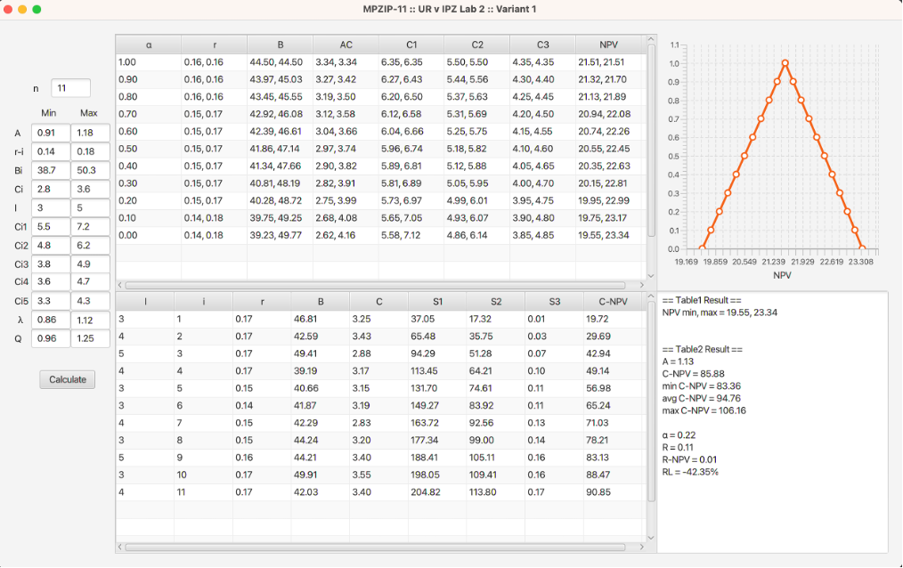
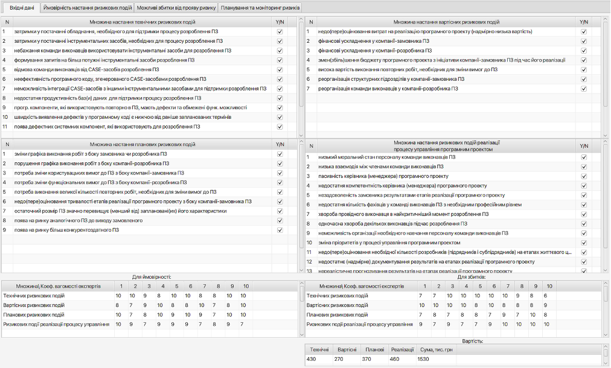
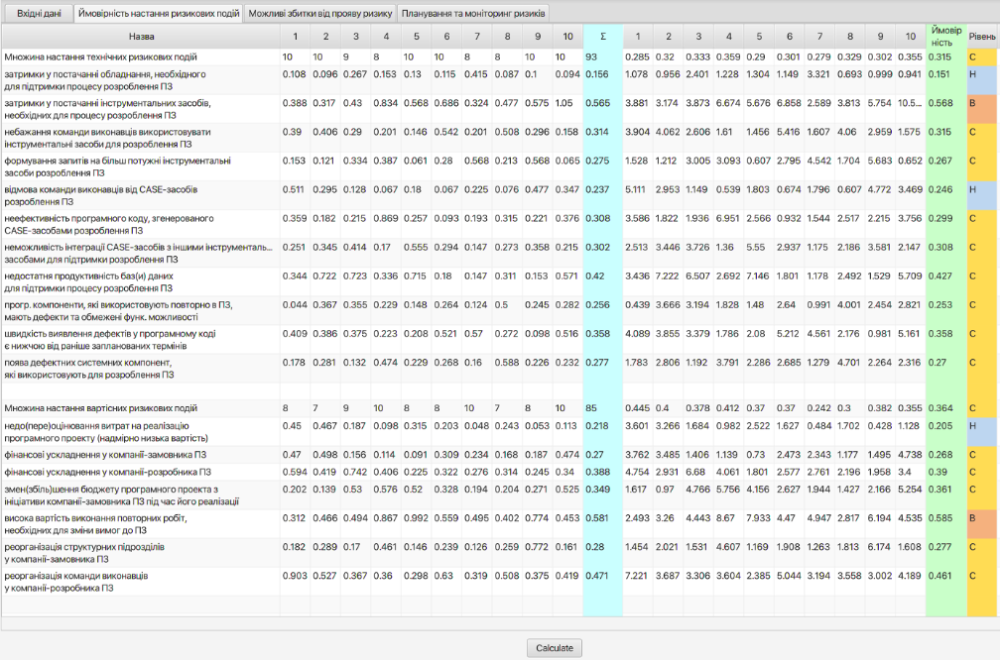
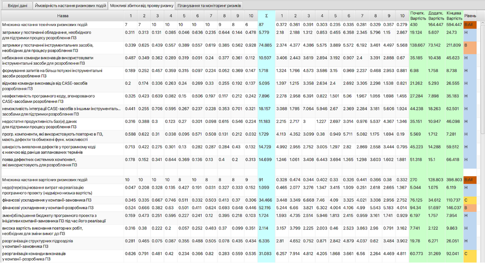

# Java/Spring Project Example
JavaFX version 17 is required

## Description

Labs for Risk Management in Software Engineering

## Screen examples

Lab 2. The result of calculating the net present value (NPV) of a software development project, taking into account negative factors 
related to the potential failure to detect security vulnerabilities:

Lab 4. Analysis of requirements specification and risk management in software development. Implemented functionality:
- Identification of sources of potential risks in a software project
- Assessment of software development risks, determination of their priority, and definition of mitigation or elimination measures
- Selection of the most effective action to maximize the reduction of each risk.

Input data:

The result of calculating the probabilities of risk events occurring:

The result of calculating potential losses from risk occurrence:

